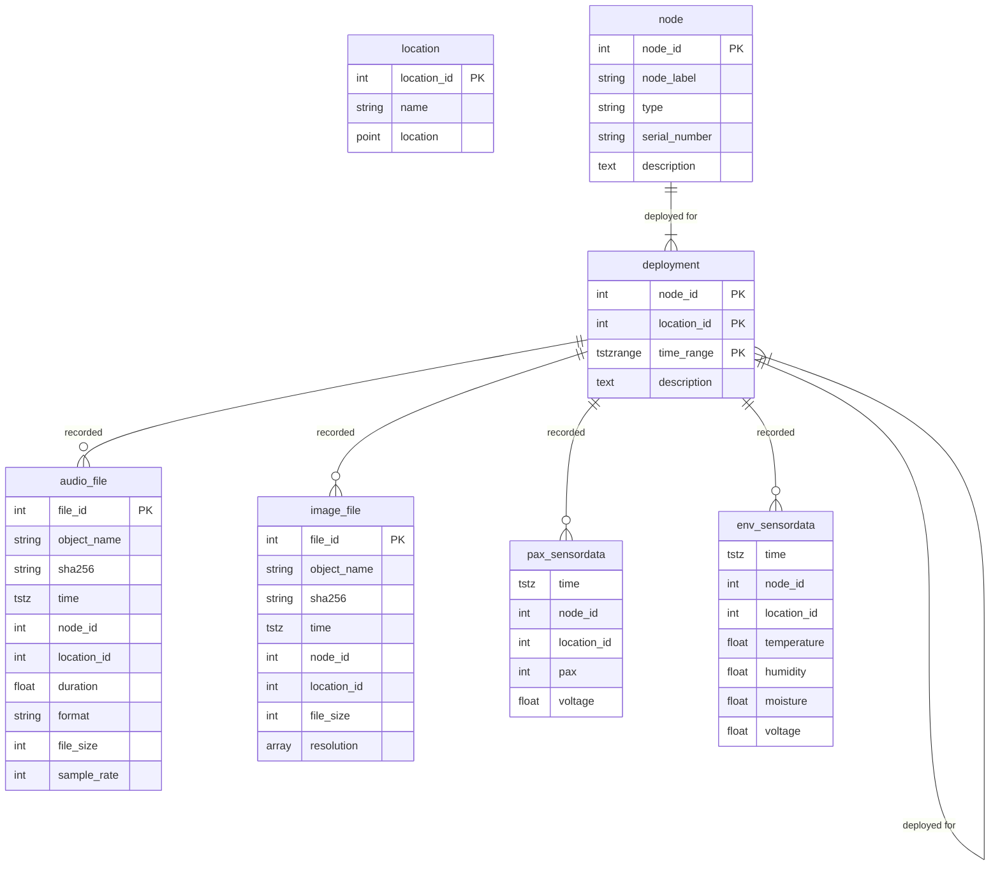

# Notes on development of schema

## Constructing `nodes` and `locations`

### Transfer `node_id`

```sql
-- assembled from mitwelten_v1.sql
insert into dev.nodes (node_label, serial_number, type)
values
('8676-2428','eui-70b3d57ed0043d2d', 'env'),
('9260-1607','eui-70b3d57ed0043d54', 'env'),
('7071-0496','eui-70b3d57ed0043d5c', 'env'),
('1238-5580','eui-70b3d57ed0043d68', 'env'),
('0781-0858','eui-70b3d57ed0043d6a', 'env'),
('1955-8871','eui-70b3d57ed0043d70', 'env'),
('7353-5703','eui-70b3d57ed0043d73', 'env'),
('3369-4484','eui-70b3d57ed0043d76', 'env'),
('9565-3553','eui-70b3d57ed0043d7b', 'env'),
('5735-6956','eui-70b3d57ed0043d7f', 'env'),
('8626-2032','eui-70b3d57ed0043d84', 'env'),
('2734-7381','eui-70b3d57ed0043d85', 'env'),
('3726-6652','eui-70b3d57ed0043d86', 'env'),
('3760-9036','eui-70b3d57ed0043d8a', 'env'),
('8987-4856','eui-70b3d57ed0043d8d', 'env'),
('4835-8701','eui-3c6105498c70feff', 'pax'),
('0694-6129','eui-3c61054b0e74feff', 'pax'),
('4496-3521','eui-3c61054b0f5cfeff', 'pax'),
('3426-5375','eui-c4dd579cd520feff', 'pax'),
('9975-8297','eui-c4dd579ebfa0feff', 'pax');

insert into dev.nodes(node_label, type)
-- omit serial_number, as it doesn't align with device_id
select distinct device_id, 'audiomoth'
from public.files -- initial table used to import audiomoth files
where device_id is not null
order by device_id asc;

insert into dev.nodes(node_label, type)
select distinct node_id, 'cam'
from public.files_image -- initial table used to import image files
order by node_id asc;
```

### Insert locations

```sql
-- assembled from https://docs.google.com/spreadsheets/d/1H2KUk-7AxRO8rgsI3cCtQ9gxSG7RggAHPazr1KrZhzk/
insert into dev.locations(name, description, location) values
('Bauerngarten (Bats)', 'Standort Bauerngarten (Bats)', point(47.535255865, 7.614006247)),
('Berri-Scheune (Bats)', 'Hinter der Berri-Scheune Richtung St.Alban-Dyych (Bats)', point(47.537170071, 7.614982059)),
(null, 'on a sidewall of a storage building in the Merian Gardens', point(47.53514, 7.61467)),
(null, 'on a tree at the meadow near the sheep and chicken shed', point(47.53607, 7.61493)),
('Lehmhaus', 'Lehmhaus', point(47.534230119, 7.614490083)),
('Villa', 'Villa', point(47.534649, 7.613092)),
('Garten', 'Garten', point(47.535135, 7.614674)),
('Weide', 'Weide', point(47.536054, 7.614804)),
('Weiher', 'Weiher', point(47.538413, 7.615415)),
('Greifengasse', 'Greifengasse', point(47.5612038295474, 7.591551112713341)),
('Gundeli', 'Gundeli', point(47.54329652492795, 7.596164727046104)),
('Kanal', 'Kanal', point(47.537386128, 7.615148802));

insert into dev.files_audio(object_name, sha256, time, node_id, location_id, duration, serial_number, format, file_size, sample_rate, bit_depth, channels, battery, temperature, gain, filter, source, rec_end_status, comment, class, created_at, updated_at)

select
file_path||file_name,
sha256, time_start,
(SELECT node_id FROM dev.nodes WHERE node_label = device_id),
(SELECT location_id FROM dev.locations dl WHERE dl.location ~= files.location),
duration, serial_number, format, file_size, sample_rate,
bit_depth, channels, battery, temperature, gain, filter, source, rec_end_status, comment, class, created_at, updated_at
from public.files -- initial table used to import audiomoth files
where state = 'uploaded';
```

### Insert images

```sql
insert into dev.files_image(file_id, object_name, sha256, time, node_id, file_size, resolution)
select file_id, object_name, sha256, time, (select node_id from dev.nodes dn where dn.node_label = f.node_id), file_size, resolution
from public.files_image f
on conflict do nothing;
```

### Join tables (example)

```sql
select object_name, time, node_label, duration, pg_size_pretty(file_size::numeric), location, l.description
from dev.files_audio f
left join dev.locations l on f.location_id = l.location_id
left join dev.nodes n on f.node_id = n.node_id
where f.location_id is not null
order by object_name desc limit 10
```

## Database schema according to visualisation project

<https://viz.mitwelten.org/api/#/>

```ts
interface nodes {
  node_id: string, // example: 5735-6956
  location_id: number, // example: 10
  type: string, // example: env
  description: string, // example: Environment sensor
}
interface tags {
  id: number,
  name: number, // example: 10
}
interface entries {
  id: number,
  name: string, // example: Entry
  description: string, // example: Environment sensor description
  lat: Float, // example: 47.234234
  lng: Float, // example: 7.234234
  type: string, // example: env
}
interface env {
  node_id: string, // example: 5735-6956
  voltage: number, // example: 4
  voltageUnit: string, // example: V
  temperature: number, // example: 7.82
  temperatureUnit: string, // example: °C
  humidity: number, // example: 93.78
  humidityUnit: string, // example: %
  moisture: number, // example: 567
  moistureUnit: string, // example: %
  time: string, // example: 2021-11-30T16:51:45.864688+01:00
}
interface pax {
  node_id: string, // example: 4496-3521
  voltage: number, // example: 2.68
  voltageUnit: string, // example: V
  pax: number, // example: 17
  paxUnit: number, // example:
  time: date, // example: 2021-11-23T21:56:36.745248+01:00
}
interface url {
  url: string, // example: https://mitwelten-backend.herokuapp.com/api/images/IMG_20211022_155430.jpg
}
```

### Comments / Questions

- How does the actual schema look like?
- `nodes` do not have a fixed location, they can be moved between experiments
- `locations` is missing, maybe `entries` is supposed to be the entity that shoud be `locations`?

```ts
interface location {
  lat: number
  lon: number
}
interface locations {
  location_id: number,
  name: string,
  location: location, // example: location(47.234234, 7.234234). can be transformed to separate fields for json compatibility
}
```

## Theoretical Schema

In theory, `nodes` are used at `locations` in a given time span. That would result in an ERD like the one below, where the relation `deployment` is uniquely identified by `node`, `location` and `time_range`.

The seems unnecessarily complicated to manage in development, the suggestion is to cut `deployment` and store `node`, `location` and `timestamp` in every record.


