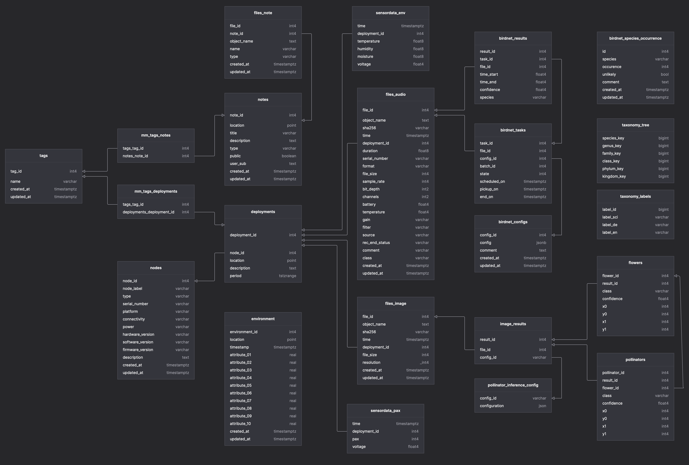
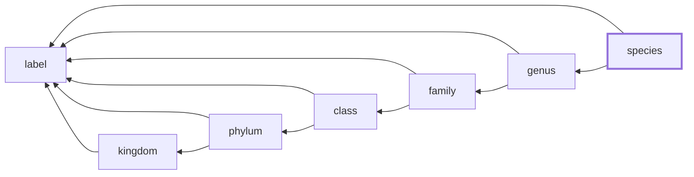

# Mitwelten Database Setup

The database backend hosts 3 databases for specific domains of data: Project internal data ([`mitwelten_data`](#mitwelten-data), or just `mitwelten`), cached 3rd party data ([`mitwelten_cache`](#mitwelten-cache)), and authorisation data ([`mitwelten_auth`](#mitwelten-auth)). The databases keep these domains logically separated.

## Mitwelten Data

- The schema is functionally described in [mitwelten_v2.sql](./mitwelten_v2.sql). It was developped on the previous schema ([mitwelten_v1.sql](./mitwelten_v1.sql)) and the schema built for the _ingest process_ of the project [mitwelten-ml-backend](https://github.com/mitwelten/mitwelten-ml-backend). For details see [NOTES.md](./NOTES.md)
- 05.12.2022: The schema v2.1 was expanded with additional tables for the pollinator model resulting in [schema v2.2](./assets/diagram_v2.2.png) ([mitwelten_v2.sql](./mitwelten_v2.sql))
- 23.01.2023: The schema v2.2 was expanded with additional tables for environment and imported taxonomy records resulting in [schema v2.3](./assets/diagram_v2.3.png) ([mitwelten_v2.sql](./mitwelten_v2.sql))
- 21.09.2023: The entity `entries` has been renamed to `notes`, resulting in [schema v2.4](./assets/diagram_v2.4.png) ([mitwelten_v2.sql](./mitwelten_v2.sql)).



_Source: [mitwelten_v2.4.diagram](./assets/mitwelten_v2.4.diagram) generated with TablePlus._

### Entities

#### node

Device (hardware), mostly used to collect data.

##### Attributes

- (unique) _node label_ of the format `1234-5678`
- unique identifier (_serial number_[^node_labels_sn] or _eui_)
- _type_ (`Optical`, `Audio`, `HumiTempMoisture`, `Access Point` etc.)
- _platform_ (`Audiomoth`, `FeatherM4Express` etc.)
- _connectivity_ describing the mode of data exchange
- _power_ source (`230V`, `LiPo`, etc.)
- _hardware-_, _software-_ and _firmware version_
- _description_
- timestamps for change tracking (_created\_at_, _updated\_at_)

[^node_labels_sn]: Previously, some of the _node labels_ were used with multiple devices: The _node labels_ for Audiomoths are printed on SD-cards, a few of the were used in multiple devices. The _serial numbers_ of those devices identify the node in that case and are stored in the `files_audio` records, not in the `node` records.

#### deployment

The _time period_ in which a _node_ has been or is installed at a specific _location_.

- Has foreign keys to _nodes_
- Has a _location_ in the format WGS84: ° (latitude, longitude), currently implemented as `point(latitude, longitude)`[^postgis_ext]
- Can have a location _description_
- Has a time _period_

The combination of node and period is constrained to be unique and non-overlapping.

[^postgis_ext]: For geographic calculations the PostGIS extension could be added to the db in the future.

#### sensordata

Several types of sensordata, currently _environmental_ and _pax_. Records are assigned to `deployment` and must have a _timestamp_.

#### files

Several types of files, currently audio and images.

- are assigned to `deployment`
- must have a _timestamp_
- must have a unique _object name_ by which the file is identified in S3 storage
- must have unique content, identifyed by `sha256`

There is a separate relation for files uploaded by the _discover-app_,
that does not have an attribute for `deployment`.

#### note

Notes can be added by authenticated users of the discover-app.
It is planned to add this functionality to deployments, where the notes
themselves don't need to have a location.

- Has an associated author (user, in form of its KeyCloak identifier _user\_sub_)
- Has a flag _public_ indicating if the record is shown to unauthenticated users
- Can have a _title_
- Can have a _description_
- Can have a _type_ (descriptive string)
- Can have a _location_ (same format as `deployment`)
- Can have multiple _tags_
- Can have multiple _files_
- Has timestamps for change tracking (_created\_at_, _updated\_at_)

#### tag

- Has a unique _name_

Records of `note` and `deployment` can be tagged with multiple tags, using the tables `mm_tags_notes` and `mm_tags_deployments`.

#### storage_backend

At a later stage of the project, a storage layer has been added that allows to store files in different locations.
The table `storage_backend` holds the information about the storage backend, while the tables `mm_files_*_storage`
(`*` = `audio`, `image` and `note`) track the assignment of files to storage locations as well as the file _type_.

The _file type_ is used to distinguish between original files and scaled versions, or to store additional metadata.
This enables the folling scenario:

- The original file (type 0) is stored offline in an archive storage
- a scaled and compressed version (type 1) is stored in the online S3 storage
- another scaled version (type 2) is stored in a different location

The metadata stored in `files_audio` etc. corresponds to the type 0, i.e. original file.
The other types don't have their own metadata, but arbitrary types can be defined.
As of now, `type 1` is defined as __scaled to 1920x1440 pixels (preserving aspect ratio) and 'webp' compressed__.
This change requires adjustments to the API endpoints, rewriting object names depending on the file type.

More details on the storage layer can be found in the [storage README](../storage/README.md).

#### BirdNET pipeline

- __tasks__: queue table, mapping files to inference configurations, tracking the state of tasks
- __configs__: inference configuration
- __results__: identified species
- __species occurrence__: manually maintained list of species expected to be spotted at project location

#### Pollinator Pipeline

- __image_results__: Acts as connection table betweend different model configurations and results
- __pollinator_inference_config__: Holds all model configurations used for inference
- __flowers__: Holds predicted flowers with bounding boxes
- __pollinators__: Holds predicted pollinators with bounding boxes

Source code: <https://github.com/mitwelten/pollinator-ml-backend>

#### Environment

Parametric description (10 attributes) of an environment at a given location.

#### Taxonomy

Taxonomy data imported from [GBIF](https://gbif.org). The levels in the taxonomy (table `taxonomy_tree`)
refer to eachother by a GBIF defined key, with the most specific instance at
_species_ level. This data is used to associate scientific descriptors with
translated labels (table `taxonomy_labels`).



The taxonomy data is imported manually using [taxonomy_gbif.py](../import/taxonomy_gbif.py).
This procedure can be repeated when new species are inferred.

### Foreign Tables

To let the REST endpoints link user-data to records, the table `user_entity` of Keykloak is added as foreign table. The user mappings need to be updated manually with the corresponding password set for the _unprivileged role_ during provisioning:

```sql
ALTER USER MAPPING FOR mitwelten_admin SERVER auth
    OPTIONS (ADD password '******');

ALTER USER MAPPING FOR mitwelten_internal SERVER auth
    OPTIONS (ADD password '******');
```

----

## Mitwelten Auth

This database hosts the schema provided by [Keycloak](https://www.keycloak.org/).

During provisioning a role is added that is granted read-only access to the `user_entity` table as defined in
[mitwelten_auth_v1.sql](./mitwelten_auth_v1.sql). This role is used for user-mapping in a _foreign data wrapper_ (FDW) -
granting access to user information for queries in the `mitwelten_data` database.

----

## Mitwelten Cache

For caching [GBIF occurence data](https://www.gbif.org/occurrence/search), and potentially other 3rd party data that is
expensive to query, this database hosts the corresponding tables.

The tables are defined in [mitwelten_cache_v1.sql](./mitwelten_cache_v1.sql)

### Enities / Tables

#### gbif

| Fieldname | Notes |
| --- | --- |
| `key` | `int`: GBIF Occurence Key |
| `eventDate` | `timestamp` |
| `decimalLatitude` | [^occurrence_coords] |
| `decimalLongitude` | |
| | |
| taxonKey | [^gbif_levels] [^gbif_l10n] |
| kingdomKey | |
| phylumKey | |
| classKey | |
| orderKey | |
| familyKey | |
| genusKey | |
| speciesKey | |
| | |
| references | Link to original occurence [^gbif_references] |
| | |
| datasetKey |
| datasetName | via GET `https://api.gbif.org/v1/dataset/{datasetKey}` -->.title |
| datasetReference | `https://www.gbif.org/dataset/{datasetKey}` |
| license |
| | |
| basisOfRecord | Enum [BasisOfRecord](https://gbif.github.io/gbif-api/apidocs/org/gbif/api/vocabulary/BasisOfRecord.html) |
| | |
| mediaType | `Enum {None, StillImage, Sound, MovingImage , InteractiveResource }` [^gbif_mediaType] |
| media | `json` |

##### Example media content

```json
[
  {
    "type": "Sound",
    "format": "audio/mp4",
    "references": "https://www.inaturalist.org/photos/579426",
    "created": "2023-01-01T13:02:32.000+00:00",
    "creator": "kunal_kodkani",
    "publisher": "iNaturalist",
    "license": "http://creativecommons.org/licenses/by-nc/4.0/",
    "rightsHolder": "kunal_kodkani",
    "identifier": "https://static.inaturalist.org/sounds/579426.m4a?1672578152"
  },
  {
    "type": "StillImage",
    "format": "image/jpeg",
    "references": "https://www.inaturalist.org/photos/250077536",
    "created": "2023-01-01T13:01:46.000+00:00",
    "creator": "kunal_kodkani",
    "publisher": "iNaturalist",
    "license": "http://creativecommons.org/licenses/by-nc/4.0/",
    "rightsHolder": "kunal_kodkani",
    "identifier": "https://inaturalist-open-data.s3.amazonaws.com/photos/250077536/original.jpg"
  }
]
```

[^occurrence_coords]: Es werden nur Beobachtungen mit vorhandenen Koordinaten gespeichert, WGS 84

[^gbif_levels]: Es kann sein, dass eine Beobachtung nur bis zu einem bestimmten Level bestimmt werden, deshalb können die folgenden Keys auch Null sein.

[^gbif_l10n]: Die Namen der entsprechenden Klassen können wir via [Mitwelten DB](#taxonomy) übersetzen. Sonst müssten hier auch `sciName`, `nameDE`, `nameEN` vorhanden sein.

[^gbif_references]: Falls nicht vorhanden, könnte der Link auf den entsprechenden GBIF Eintrag `https://www.gbif.org/occurrence/{key}` gesetzt werden. Den GBIF Eintrag gibt es immer. Beispiele des selben Eintrags auf iNaturalist und auf GBIF: <https://www.gbif.org/occurrence/4011857148>, <https://www.inaturalist.org/observations/145573896>

[^gbif_mediaType]: [MediaType](https://gbif.github.io/gbif-api/apidocs/org/gbif/api/vocabulary/MediaType.html), Eine Beobachtung kann über mehrere Formate verfügen.
