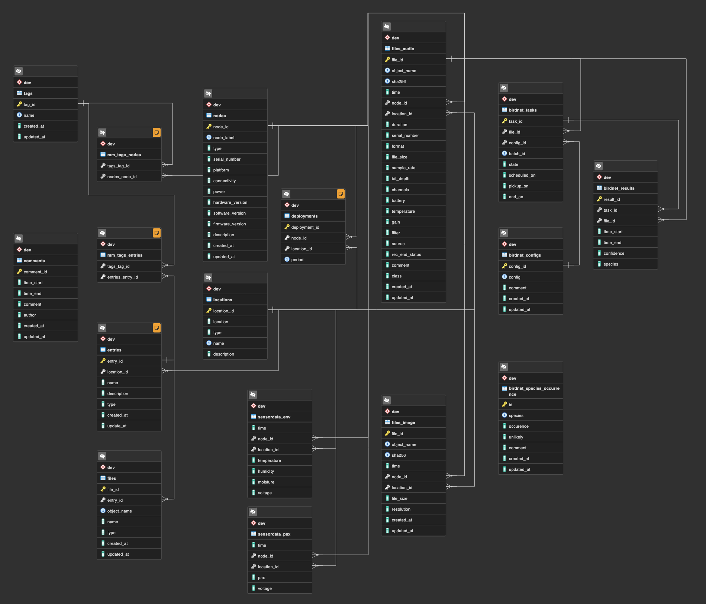

# Mitwelten Database Schema

The schema is functionally described in [mitwelten_v2.sql](./mitwelten_v2.sql). It was developped on the previous schema ([mitwelten_v1.sql](./mitwelten_v1.sql)) and the schema built for the _ingest process_ of the project [mitwelten-ml-backend](https://github.com/mitwelten/mitwelten-ml-backend). For details see [NOTES.md](./NOTES.md).

_Source: [mitwelten_v2.pgerd](./mitwelten_v2.pgerd). Note: Schema name in ERD is `dev`, in production `public` will be used._

## Entities

### node

Device (hardware) used to collect data.

- Has a _node label_ of the format `1234-5678`
- Has a unique identifier (_serial number_[^node_labels_sn] or _eui_)
- Has a _type_ (`env`, `pax`, `audiomoth`, `cam` etc.)

[^node_labels_sn]: Previously, some of the _node labels_ were used with multiple devices: The _node labels_ for Audiomoths are printed on SD-cards, a few of the were used in multiple devices. The _serial numbers_ of those devices identify the node in that case and are stored in the `files_audio` records, not in the `node` records.

### location

A "pin" on the map: A _fixed location_ of an appliance, node, event or other entity.

- Has a _location_ in the format WGS84: ° (latitude, longitude), currently implemented as `point(latitude, longitude)`[^postgis_ext]
- Has a _unique name_ (like "Villa, 60cm above ground")

[^postgis_ext]: For geographic calculations the PostGIS extension could be added to the db in the future.

### sensordata

Several types of sensordata, currently environmental and pax. Records are assigned to `location` and `node` and must have a _timestamp_.

### files

Several types of files, currently audio and images.

- are assigned to `location` and `node`
- must have a _timestamp_
- must have a unique _object name_ by which the file is identified in S3 storage
- must have unique content, identifyed by `sha256`

### BirdNET pipeline

- __tasks__: queue table, mapping files to inference configurations, tracking the state of tasks
- __configs__: inference configuration
- __results__: identified species
- __species occurrence__: manually maintained list of species expected to be spotted at project location
