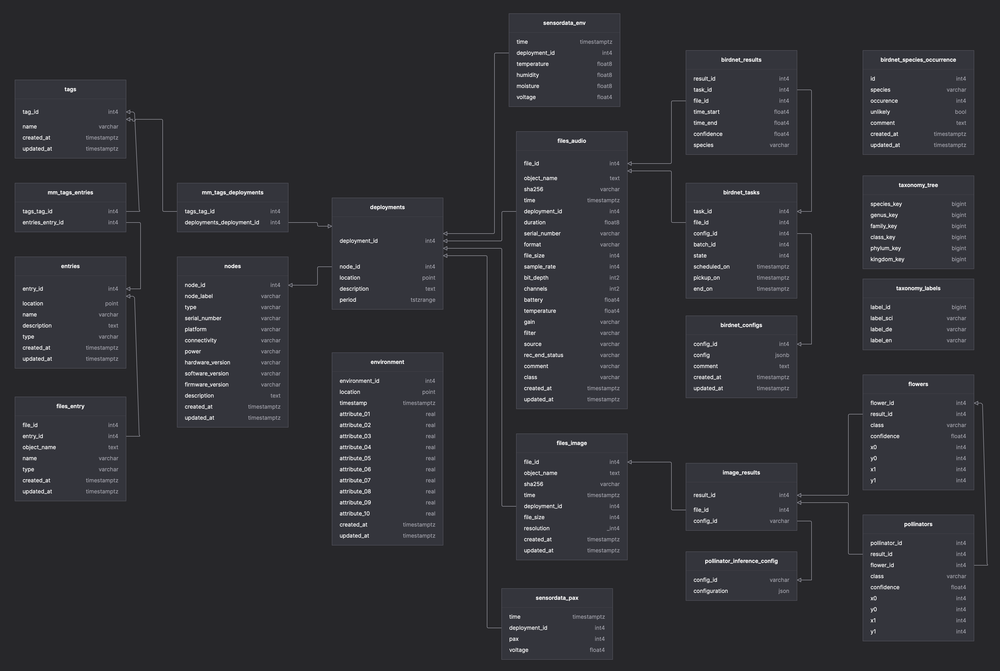

# Mitwelten Database Schema

- The schema is functionally described in [mitwelten_v2.sql](./mitwelten_v2.sql). It was developped on the previous schema ([mitwelten_v1.sql](./mitwelten_v1.sql)) and the schema built for the _ingest process_ of the project [mitwelten-ml-backend](https://github.com/mitwelten/mitwelten-ml-backend). For details see [NOTES.md](./NOTES.md)
- 05.12.2022: The schema v2.1 was expanded with additional tables for the pollinator model resulting in [schema v2.2](./assets/diagram_v2.2.png) ([mitwelten_v2.sql](./mitwelten_v2.sql))
- 23.01.2023: The schema v2.2 was expanded with additional tables for environment and imported taxonomy records resulting in [schema v2.3](./assets/diagram_v2.3.png) ([mitwelten_v2.sql](./mitwelten_v2.sql))

_Source: [mitwelten_v2.3.diagram](./mitwelten_v2.3.diagram) generated with TablePlus. Other options: [mitwelten_v2.3.pgerd](./mitwelten_v2.3.pgerd) for use in pgAdmin4._

## Entities

### node

Device (hardware), mostly used to collect data.

#### Attributes

- (unique) _node label_ of the format `1234-5678`
- unique identifier (_serial number_[^node_labels_sn] or _eui_)
- _type_ (`Optical`, `Audio`, `HumiTempMoisture`, `Access Point` etc.)
- _platform_ (`Audiomoth`, `FeatherM4Express` etc.)
- _connectivity_ describing the mode of data exchange
- _power_ source (`230V`, `LiPo`, etc.)
- _hardware-_, _software-_ and _firmware version_
- _description_
- timestamps for change tracking (_created\_at_, _updated\_at_)

[^node_labels_sn]: Previously, some of the _node labels_ were used with multiple devices: The _node labels_ for Audiomoths are printed on SD-cards, a few of the were used in multiple devices. The _serial numbers_ of those devices identify the node in that case and are stored in the `files_audio` records, not in the `node` records.

### deployment

The _time period_ in which a _node_ has been or is installed at a specific _location_.

- Has foreign keys to _nodes_
- Has a _location_ in the format WGS84: ° (latitude, longitude), currently implemented as `point(latitude, longitude)`[^postgis_ext]
- Can have a location _description_
- Has a time _period_

The combination of node and period is constrained to be unique and non-overlapping.

[^postgis_ext]: For geographic calculations the PostGIS extension could be added to the db in the future.

### sensordata

Several types of sensordata, currently _environmental_ and _pax_. Records are assigned to `deployment` and must have a _timestamp_.

### files

Several types of files, currently audio and images.

- are assigned to `deployment`
- must have a _timestamp_
- must have a unique _object name_ by which the file is identified in S3 storage
- must have unique content, identifyed by `sha256`

There is a separate relation for files uploaded by this _viz-dashboard_, that does not
have an attributes for `deployment`.

### entry

- Has a _name_
- Has a _description_
- Has _location_ (same format as `deployment`)
- Has a type
- Can have multiple _tags_
- Can have multiple _files_
- Has timestamps for change tracking (_created\_at_, _updated\_at_)

### tag

- Has a unique _name_

Records of `entry` and `deployment` can be tagged with multiple tags, using the tables `mm_tags_entries` and `mm_tags_deployments`.

### BirdNET pipeline

- __tasks__: queue table, mapping files to inference configurations, tracking the state of tasks
- __configs__: inference configuration
- __results__: identified species
- __species occurrence__: manually maintained list of species expected to be spotted at project location

### Pollinator Pipeline

- **image_results**: Acts as connection table betweend different model configurations and results
- **pollinator_inference_config**: Holds all model configurations used for inference
- **flowers**: Holds predicted flowers with bounding boxes
- **pollinators**: Holds predicted pollinators with bounding boxes

Source code: https://github.com/mitwelten/pollinator-ml-backend

### Environment

Parametric description (10 attributes) of an environment at a given location.

### Taxonomy

Taxonomy data imported from [GBIF](https://gbif.org). The levels in the taxonomy
refer to eachother by a GBIF defined key, with the most specific instance at
_species_ level. This data is used to associate scientific descriptors with
translated labels.

The taxonomy data is imported manually.
