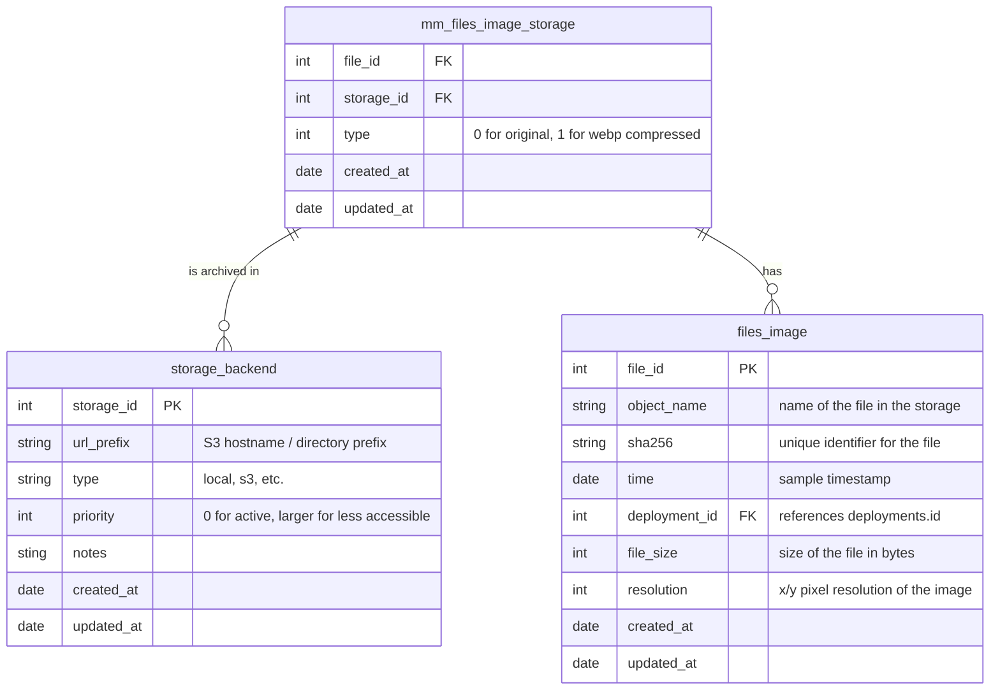

# Mitwelten Storage Layer

## Installation

```bash
python -m venv .venv
source .venv/bin/activate
pip install --upgrade pip
pip install -r requirements.txt
```

## Usage

Add a storage backend:

```bash
python create_storage_backend.py -t local -p 2 -n 'mw-archiv-1' /Volumes/mw-archiv-1
```

List storage backends:

```bash
python mitwelten_storage.py info -b
```

Copy batch selection `0` from storage `1` to storage `28`:

```bash
python mitwelten_storage.py copy -s 1 -t 28 0
```

- `-s` source storage: `1` is S3 active storage
- `-t` target storage: `28` is local archive storage
- `0` is the batch number to process ([`batches.py`](batches.py))

## Concept

- File storage is setup as multi-tier storage system
- Database is postgresql
- Database handles metadata for file storage
- File storage tiers are:
  - active: online S3 storage, for data that is currently used
  - archive: offline, backup of original research data when online storage is replaces with downscaled content

### Structure of a local storage backend

A local storage backend consists of the following components:

| Component               | Description                                                               |
| ----------------------- | ------------------------------------------------------------------------- |
| `.mitwelten-storage-id` | dot-file idenitfying the storage backend                                  |
| `README.md`             | auto-generated info about the SB                                          |
| `archive`               | root of data to be stored (to contain path equivalent of S3 object names) |

With the exception of the `README.md` file, all files and directories are managed by the storage backend
and should not be altered manually.

## Tasks

- identify batches of files to process
- move files from one tier to another
- compress files while always retaining one unaltered version
- handle metadata in postgres

### Model process

- identify file to process
- create scaled version in memory (in the iteration)
- copy original file to archive
- update metadata in postgres
- write scaled version to active (or delete active original)

#### next iteration

- implement service running closer to s3 storage (in REST API)
  - endpoint to request original file
  - option to request storage of scaled version upon original delivery
- GET /original/{file_id}
- once file is downloaded and written to archive, update metadata in postgres
- POST /archive/{file_id} (this sets the file to archived, without deleting anything)
- if scaled version is requested, write to active
- POST /scaled/{file_id}
  - scale image, replace original on active
  - update metadata in postgres
- or DELETE /original/{file_id} (should check that file exists in archive)

## Database



### File types

#### mm_files_image_storage

| Type | Definition      |
| ---- | --------------- |
| 0    | original        |
| 1    | webp, 1920x1440 |

#### mm_files_audio_storage

| Type | Definition |
| ---- | ---------- |
| 0    | original   |
| 1    | gzip -9    |
| 2    | FLAC       |
